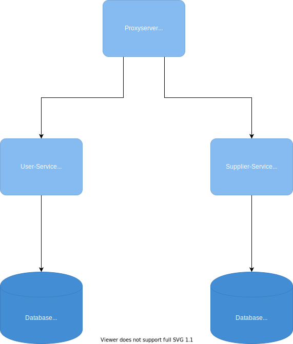
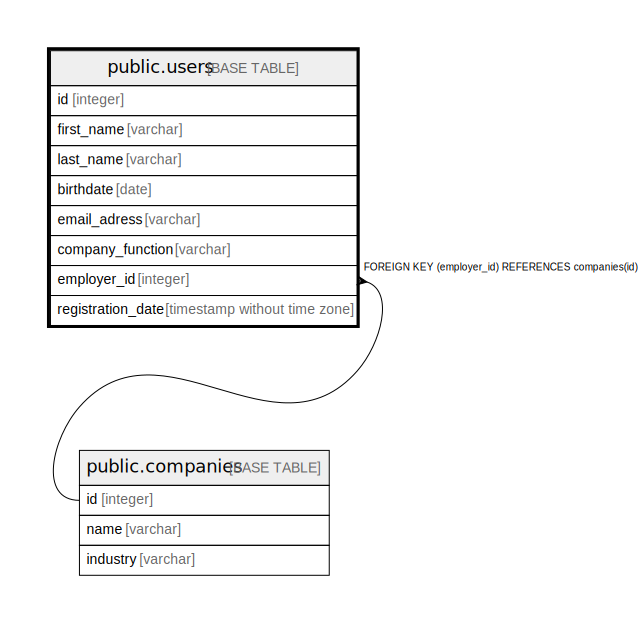
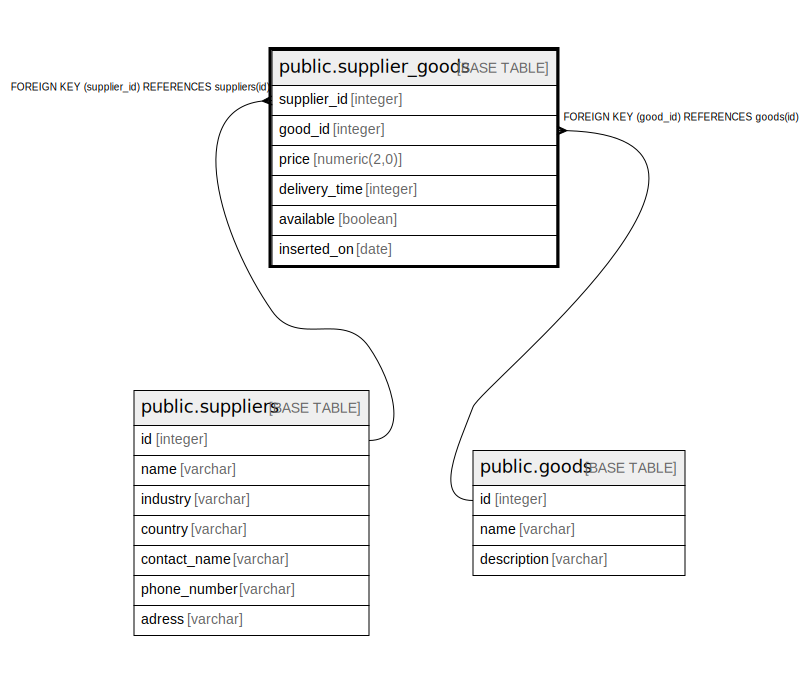

## To run the server:

Install [Docker Desktop](https://www.docker.com/get-started) or docker and docker-compose, than run in the terminal:

```
docker-compose up
```

# Architecture
## Technologies used:
* Python
* FastAPI-framework
* Docker
* nginx



# Services

## User management:
You can find an OpenAPI-documentation for the endpoints at **http://localhost/user/docs**

Or export the openapi.json at **http://localhost/user/openapi.json**

### Data model



## Supply management:
You can find an OpenAPI-documentation for the endpoints at **http://localhost/supplier/docs**

Or export the openapi.json at **http://localhost/supplier/openapi.json**

### Data model

