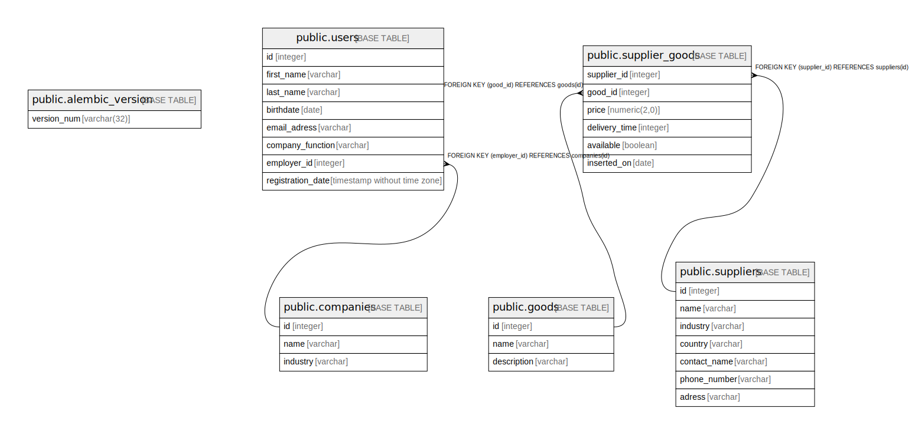

# postgres

## Tables

| Name | Columns | Comment | Type |
| ---- | ------- | ------- | ---- |
| [public.alembic_version](public.alembic_version.md) | 1 |  | BASE TABLE |
| [public.companies](public.companies.md) | 3 |  | BASE TABLE |
| [public.users](public.users.md) | 8 |  | BASE TABLE |
| [public.goods](public.goods.md) | 3 |  | BASE TABLE |
| [public.suppliers](public.suppliers.md) | 7 |  | BASE TABLE |
| [public.supplier_goods](public.supplier_goods.md) | 6 |  | BASE TABLE |

## Relations

---

> Generated by [tbls](https://github.com/k1LoW/tbls)
