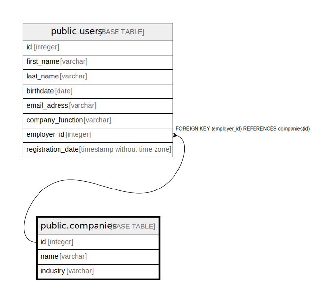

# public.companies

## Description

## Columns

| Name | Type | Default | Nullable | Children | Parents | Comment |
| ---- | ---- | ------- | -------- | -------- | ------- | ------- |
| id | integer | nextval('companies_id_seq'::regclass) | false | [public.users](public.users.md) |  |  |
| name | varchar |  | true |  |  |  |
| industry | varchar |  | true |  |  |  |

## Constraints

| Name | Type | Definition |
| ---- | ---- | ---------- |
| companies_pkey | PRIMARY KEY | PRIMARY KEY (id) |

## Indexes

| Name | Definition |
| ---- | ---------- |
| companies_pkey | CREATE UNIQUE INDEX companies_pkey ON public.companies USING btree (id) |
| ix_companies_id | CREATE INDEX ix_companies_id ON public.companies USING btree (id) |

## Relations

---

> Generated by [tbls](https://github.com/k1LoW/tbls)
