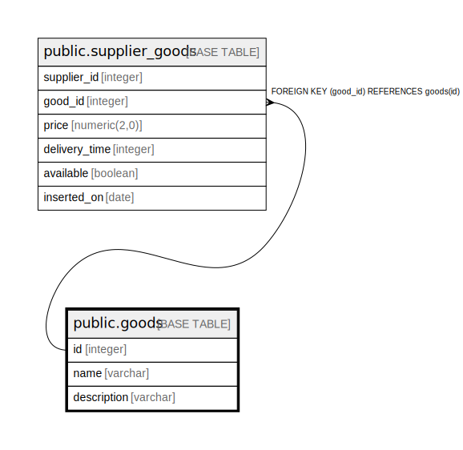

# public.goods

## Description

## Columns

| Name | Type | Default | Nullable | Children | Parents | Comment |
| ---- | ---- | ------- | -------- | -------- | ------- | ------- |
| id | integer | nextval('goods_id_seq'::regclass) | false | [public.supplier_goods](public.supplier_goods.md) |  |  |
| name | varchar |  | true |  |  |  |
| description | varchar |  | true |  |  |  |

## Constraints

| Name | Type | Definition |
| ---- | ---- | ---------- |
| goods_pkey | PRIMARY KEY | PRIMARY KEY (id) |

## Indexes

| Name | Definition |
| ---- | ---------- |
| goods_pkey | CREATE UNIQUE INDEX goods_pkey ON public.goods USING btree (id) |
| ix_goods_id | CREATE INDEX ix_goods_id ON public.goods USING btree (id) |

## Relations

---

> Generated by [tbls](https://github.com/k1LoW/tbls)
