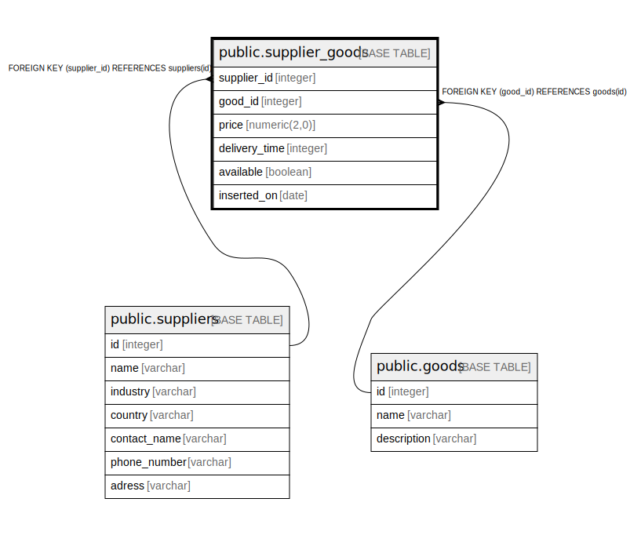

# public.supplier_goods

## Description

## Columns

| Name | Type | Default | Nullable | Children | Parents | Comment |
| ---- | ---- | ------- | -------- | -------- | ------- | ------- |
| supplier_id | integer |  | false |  | [public.suppliers](public.suppliers.md) |  |
| good_id | integer |  | false |  | [public.goods](public.goods.md) |  |
| price | numeric(2,0) |  | true |  |  |  |
| delivery_time | integer |  | true |  |  |  |
| available | boolean |  | true |  |  |  |
| inserted_on | date |  | true |  |  |  |

## Constraints

| Name | Type | Definition |
| ---- | ---- | ---------- |
| supplier_goods_good_id_fkey | FOREIGN KEY | FOREIGN KEY (good_id) REFERENCES goods(id) |
| supplier_goods_supplier_id_fkey | FOREIGN KEY | FOREIGN KEY (supplier_id) REFERENCES suppliers(id) |
| supplier_goods_pkey | PRIMARY KEY | PRIMARY KEY (supplier_id, good_id) |

## Indexes

| Name | Definition |
| ---- | ---------- |
| supplier_goods_pkey | CREATE UNIQUE INDEX supplier_goods_pkey ON public.supplier_goods USING btree (supplier_id, good_id) |

## Relations

---

> Generated by [tbls](https://github.com/k1LoW/tbls)
