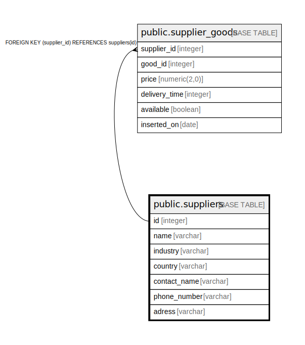

# public.suppliers

## Description

## Columns

| Name | Type | Default | Nullable | Children | Parents | Comment |
| ---- | ---- | ------- | -------- | -------- | ------- | ------- |
| id | integer | nextval('suppliers_id_seq'::regclass) | false | [public.supplier_goods](public.supplier_goods.md) |  |  |
| name | varchar |  | true |  |  |  |
| industry | varchar |  | true |  |  |  |
| country | varchar |  | true |  |  |  |
| contact_name | varchar |  | true |  |  |  |
| phone_number | varchar |  | true |  |  |  |
| adress | varchar |  | true |  |  |  |

## Constraints

| Name | Type | Definition |
| ---- | ---- | ---------- |
| suppliers_pkey | PRIMARY KEY | PRIMARY KEY (id) |

## Indexes

| Name | Definition |
| ---- | ---------- |
| suppliers_pkey | CREATE UNIQUE INDEX suppliers_pkey ON public.suppliers USING btree (id) |
| ix_suppliers_id | CREATE INDEX ix_suppliers_id ON public.suppliers USING btree (id) |

## Relations

---

> Generated by [tbls](https://github.com/k1LoW/tbls)
